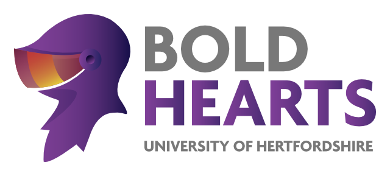

# bold-humanoid

This is the main source repository for the Bold Hearts's kid-size league agent.

See the [wiki](https://github.com/drewnoakes/bold-humanoid/wiki) for more details.

---

This repo contains the code as it stood after the RoboCup World Cup in Brazil 2014,
at which we placed second against the legendary Japanese team CIT Brains.

Development continues on this code at the [Bold Hearts repository on GitLab](https://gitlab.com/boldhearts/bold-humanoid).

All code published under the APACHE-2.0 license.

